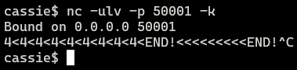
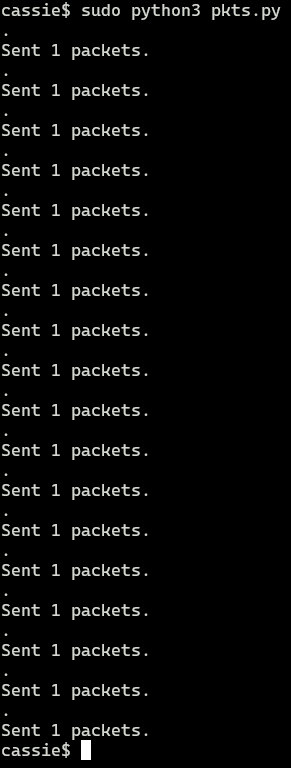
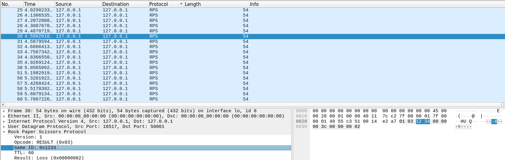

# RPS-Dissector
## Preface
I have defined my own simple Rock paper Scissors (RPS) Protocol for a Reading Course. This protocol is defined in my (rough) spec document `RPS-Specification.md`.

I have a small Pyhton script `pkts.py` that generates fake packets using Pythons Scapy.

I have created a simple Wireshark dissector `packet-rps.c` that can parse packets using this RPS protocol.

I use Netcat to act as my sever and use the python script as the client to generate and send these fake packets.

**At the moment** I am doing this all from my laptop using WSL, but I am in the works of setting up and using a PI as a DHCP server and creating my own LAN to send and monitor traffic on.

## Sending Packets
### Scapy
#### UDP Transport Layer
Using TCP as the Transport Protocol when sending apckets using Scapy came with a lot of issues because because my sending "machine" fails to sync with my receiving "machine" running netcat. [Problem Using TCP with Scapy and Netcat](https://stackoverflow.com/questions/12062781/how-to-make-netcat-display-payload-of-packet)

> Essentially, when using raw sockets (like in Scapy), you're manually crafting TCP packets instead of using the kernel's TCP stack. The kernel, has no knowledge of the custom Scapy-based session and when it sees incoming packets (e.g., SYN/ACK responses) for a TCP session it didn't initiate, the kernel sends a TCP RST packet to the endpoint, essentially tearing down the connection. This breaks my manually crafted TCP session because the listener (e.g., Netcat) will receive the RST and assume the connection is closed.

I tried a couple of work arounds:
1. Prevent the Linux kernel from sending TCP RST packets for the port I am using in my Scapy script (50001) using an iptables rule to Block TCP RST Packets
2. Following this tutorial: [Project 10: TCP Handshake with scapy (NETLAB)](https://samsclass.info/124/proj11/proj10N-123-scapy-tcp.html)
3. Using this class to handle the TCP connection: [Scapy_TcpSession.py](https://gist.github.com/N0dr4x/ffe99618a738978605719ce525a33042)

I couldn't get any of them to work so I settled on using UDP.

#### Packets
Since I am using my laptop as both the client and server I used the loopback address ``127.0.0.1`` as the destination IP.

I just made and sent one packet of each packet type specifed in my protocol spec.

### Netcat

[Netcat](https://nc110.sourceforge.io/)

```bash
nc -ulv -p 50001 -k
```

- -u for UDP connection
- -l listen for incoming connections 
- -v verbose mode for more detailed information about the connections or data being received.
- -p to specify port 50001 to listen on (specified in RPS Spec)
- -k "keep open"  continue listening for incoming packets after receiving and processing a packet, instead of terminating immediately after the first packet.

## Wireshark

1. Started with obtaining Wiresharks source code by cloning the [Wireshark repo](https://gitlab.com/wireshark/wireshark).
2. Ran the setup/verification script for Debian (Ubuntu): 
```bash
    sudo tools/debian-setup.sh --install-optional --install-deb-deps --install-test-deps
```
3. Made my plugin:
```bash
cassie@DESKTOP:~/wireshark/plugins/epan/rps$ ls
CMakeLists.txt  packet-rps.c
```
4. Update CMakeListsCustom.txt to find my plugin:
```bash
cassie@DESKTOP:~/wireshark$ cat CMakeListsCustom.txt
# CMakeListsCustom.txt
#
# Wireshark - Network traffic analyzer
# By Gerald Combs <gerald@wireshark.org>
# Copyright 1998 Gerald Combs
#
# SPDX-License-Identifier: GPL-2.0-or-later
#
# Add a list of your custom plugins SRC dir here including the path
#

# Fail CMake stage if any of these plugins are missing from source tree
set(CUSTOM_PLUGIN_SRC_DIR
#       plugins/cplugins/protofoo
# or
        plugins/epan/rps
)
```
5. Built Wireshark:
```bash
cassie@DESKTOP:~/wireshark$ mkdir build

cassie@DESKTOP:~/wireshark$ cd build

cassie@DESKTOP:~/wireshark/build$ cmake ..

cassie@DESKTOP:~/wireshark/build$ make
```
6. Run wireshark from the "run" sub-directory:
```bash
cassie@DESKTOP:~/wireshark/build/run$ sudo ./wireshark
```

## Execution
### Listening on Netcat


### Sending Packets Using Scapy


### Wireshark Dissector



